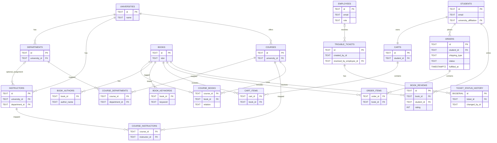

# GyanPustak ER Diagram (Concise)

## Notes

- COURSE_DEPARTMENTS, COURSE_INSTRUCTORS, COURSE_BOOKS, CART_ITEMS, and ORDER_ITEMS are junction tables.
- BOOK_REVIEWS enforces one review per student per book through a unique constraint on (book_id, student_id).
- TROUBLE_TICKETS creator can be student or support/admin-side actor depending on created_by_type.
- ORDERS.status uses a check-domain in schema: new, processed, awaiting shipping, shipped, canceled.
- API business rule: once an order is canceled, it is immutable and status transitions are blocked.

## ER to Relational Schema Conversion

The schema is converted from ER design to relational tables using standard mapping rules:

1. Strong entities become base tables with primary keys
- STUDENTS -> students(id)
- EMPLOYEES -> employees(id)
- UNIVERSITIES -> universities(id)
- DEPARTMENTS -> departments(id)
- INSTRUCTORS -> instructors(id)
- COURSES -> courses(id)
- BOOKS -> books(id)
- TROUBLE_TICKETS -> trouble_tickets(id)
- CARTS -> carts(id)
- ORDERS -> orders(id)

2. One-to-many relationships are represented by foreign keys on the many side
- departments.university_id references universities.id
- instructors.university_id references universities.id
- courses.university_id references universities.id
- orders.student_id references students.id

3. One-to-one relationships are represented by foreign key plus unique constraint
- carts.student_id references students.id and is UNIQUE (one cart per student)

4. Many-to-many relationships are converted into junction tables
- course_departments(course_id, department_id)
- course_instructors(course_id, instructor_id)
- course_books(course_id, book_id, relation)
- cart_items(cart_id, book_id, quantity, purchase_option)
- order_items(order_id, book_id, quantity)

5. Multi-valued or repeating business attributes are split into child tables
- book_authors(book_id, author_name, author_order)
- book_keywords(book_id, keyword)
- ticket_status_history(ticket_id, status, changed_by_type, changed_by_id, changed_at)

6. Relationship-specific constraints are encoded with keys and checks
- book_reviews has UNIQUE(book_id, student_id) to enforce one review per student per book
- check constraints enforce valid domains such as rating range, role, status, and relation values

## Normalization Summary

The design is normalized to reduce redundancy and update anomalies.

### First Normal Form (1NF)

Rules applied:
- Atomic columns only (no repeating groups in a single row)
- Primary keys identify each row

Examples:
- Authors and keywords are not stored as comma-separated values in books; they are in book_authors and book_keywords.
- Course mappings to departments/instructors/books are handled in separate relation tables.

### Second Normal Form (2NF)

Rules applied:
- For tables with composite primary keys, every non-key attribute depends on the full key.

Examples:
- course_books(course_id, book_id, relation): relation depends on the pair (course_id, book_id), not only one part.
- cart_items(quantity, purchase_option) depends on full composite key (cart_id, book_id).
- order_items(quantity) depends on full composite key (order_id, book_id).

### Third Normal Form (3NF)

Rules applied:
- No transitive dependency of non-key attributes on primary key.

Examples:
- University descriptive data is stored in universities and referenced by id from departments/instructors/courses.
- Student and employee profile attributes are separated from ticket and order tables; operational tables store only the foreign keys.
- Ticket status progression history is separated into ticket_status_history instead of storing repeated status data on trouble_tickets.

## Why This Normalization Helps

- Reduces duplicate data entry (for example, university names across student/course/instructor rows).
- Prevents inconsistency during updates (change once in parent table, reflect via FK joins).
- Improves integrity through FK, UNIQUE, and CHECK constraints.
- Supports scalable querying for reporting and filtering (courses by department, reviews by book, tickets by status history).
